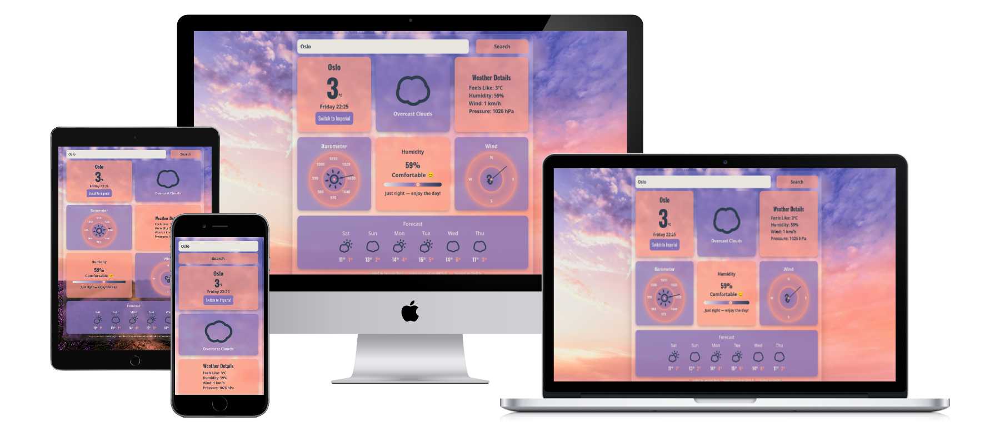

# 🌤️ SkyGlance

Your modern weather app built with React + Vite — get current conditions, daily forecasts, and trend data at a glance.

---

## 🚀 Live Demo  
Check it out here: [**SkyGlance**](https://skyglance.netlify.app)

---

## 📸 Preview

<p align="center">
  
</p>

---

## 🌟 Features

- 🌎 Search by city (default: Denver)
- 🌡 Toggle between °C / °F
- 📈 Historical temperature trend graph
- 🗓 6-day forecast
- 🍃 Air Quality Index bar
- 🔄 Auto-refreshing data
- 💨 Live weather icons
- 🌀 Smooth loading spinner

---

## 🛠️ Tech Stack

- **React** + **Vite**
- **SheCodes Weather API**
- **Chart.js** for historical trends
- **React Animated Weather** for icons
- **Bootstrap**

---

## 🚀 Getting Started

Clone the repo and run it locally:

```bash
git clone https://github.com/CindaCodes/SkyGlance.git
cd SkyGlance
npm install
npm run dev
