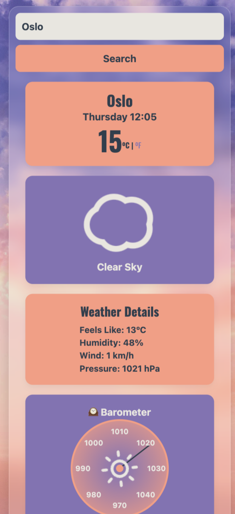

# 🌤️ SkyGlance

SkyGlance is a sleek, responsive weather app that provides real-time weather data with a modern, animated interface. Built with React and styled using glassmorphism, it offers a beautifully clean experience on both desktop and mobile.

<p align="center">
  
  <br />
  
  <br />
  
</p>

[🖥️ Live Demo](https://skyglance.netlify.app/)

---

## ✨ Features

- 🔍 **City Search** with real-time weather updates  
- 🌡️ **Detailed Metrics**: temperature, “feels like,” humidity, wind speed/direction, and air pressure  
- 🎯 **Custom Pressure Gauge** with animated needle and theme integration  
- 🌍 **World Clock Integration** for global time awareness  
- 🎨 **Themed Design** using CSS variables and gradient styling  
- 📱 Fully responsive, mobile-friendly layout  

---

## 🛠️ Tech Stack

- **React** with Vite  
- **CSS3** + CSS Variables (Glassmorphism, Responsive Grid)  
- **ReactAnimatedWeather** for live animated icons  
- **SheCodes Weather API** for real-time data  
- **Netlify** for fast and easy deployment  

---

## 🚀 Getting Started

```bash
git clone https://github.com/CindaCodes/SkyGlance
cd skyglance
npm install
npm run dev
